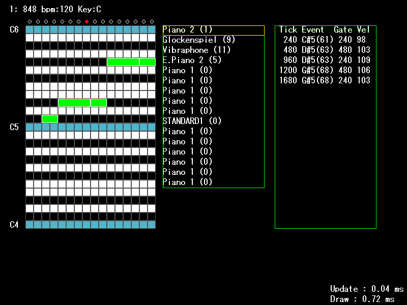

# MidiProject2
WindowsAPIとDXライブラリを使用して作っているMIDIシーケンサです。

## 主なファイルの説明
### MainScene.cpp
キー操作による分岐処理が書かれています。「Q」キーでCUIインターフェースに入れる機能もあります。

### MidiController.cpp
MIDI機器を取り扱います。（初期化、メッセージの送信など）

### MidiEventManager.cpp
MIDIイベントを操作します。

### smfIO.cpp
SMFの読み書きに関する処理

### Conducter.cpp
テンポ、再生速度の管理
